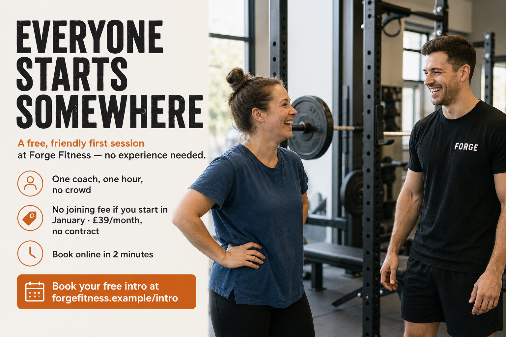

# Example 1 — "January Fresh Start"

**Persona:** Nervous Newcomer · **Goal:** book free intro sessions · **Deliverable:** full kit

This is the system running end-to-end from a single brief. The brief below is the
*only* input; everything after it is the AI's output, unedited.

---

## INPUT — the brief

```text
CAMPAIGN BRIEF
- Campaign name: January Fresh Start
- Goal: 30 free intro sessions booked in the first 3 weeks of January
- Target persona: Nervous Newcomer
- The one action we want them to take: book a free coached intro session
- Offer or hook: free intro + no joining fee if they start in January
- Key dates: runs 2–24 January; sessions bookable via website
- Must-include details: £39/month after; forgefitness.example/intro; no contract
- Deliverables: the full kit
- Anything to avoid this time: don't lean on "New Year New You" — we hate that
```

---

## OUTPUT — the plan

- **Goal:** get 30 nervous first-timers to book a free coached intro in early January.
- **Persona & action:** Nervous Newcomer → book a free intro session online.
- **Angle:** "You don't need to be fit to start — that's what the free intro is for."
  Remove the fear, not the excuses.
- **Deliverables:** 3 social posts, 1 email, 1 paid ad, 1 flyer concept.

## OUTPUT — social posts

**Post 1**
> Never set foot in a gym before? Perfect.
> Our free intro session is one coach, one hour, no crowd — just you learning the
> ropes at your own pace. No pressure to sign up, and honestly no pressure to lift
> anything heavy. You bring the trainers, we'll bring the patience.
> Book yours 👉 forgefitness.example/intro
> #RiversideGym #FreeIntro #EveryoneStartsSomewhere

**Post 2**
> The scariest part of the gym is the front door.
> After that, it's just people getting a bit stronger — most of them figuring it out
> as they go, same as you. Come meet a coach for a free hour this January. No contract,
> no joining fee if you start this month.
> forgefitness.example/intro
> #RiversideGym #StrengthForEveryone

**Post 3**
> "I'll go when I'm a bit fitter." We hear this a lot. 🙌
> Here's the thing — getting fitter *is* the reason to come. Your free intro starts
> exactly where you are, whatever that looks like. One coach, one hour, zero judgement.
> Book in: forgefitness.example/intro
> #RiversideGym #FreeIntro

## OUTPUT — email

**Subject:** A gentle first step, whenever you're ready
**Preview:** One coach, one hour, no pressure — and it's free this January.

> Hi there,
>
> If the gym has always felt like somewhere for *other* people, this is for you.
>
> Our free intro is a single hour with one of our coaches. No class, no crowd, no
> being watched. Just someone friendly showing you around and helping you try a few
> things at your own pace. Loads of our members booked exactly this — nervous, unsure,
> convinced everyone else knew what they were doing. They didn't either.
>
> Start any time this January and there's no joining fee, and it's £39/month after
> with no contract. Come once and see how it feels.
>
> Book your free intro → forgefitness.example/intro
>
> — Sam, Head Coach at Forge Fitness

## OUTPUT — paid ad

- **Headline:** Your first hour is on us
- **Primary text:** Nervous about starting? A free coached intro, at your pace. Book today.

## OUTPUT — flyer concept

- **Headline:** Everyone Starts Somewhere
- **Subhead:** A free, friendly first session at Forge Fitness — no experience needed.
- **Bullets:**
  - One coach, one hour, no crowd
  - No joining fee if you start in January · £39/month, no contract
  - Book online in 2 minutes
- **Call-to-action:** Book your free intro at forgefitness.example/intro
- **Image direction:** A real-looking first-timer (not a model, not mid-flex) laughing
  with a coach beside a squat rack — warm daylight, welcoming, unposed.

[Forge_Everyone_Starts.png](https://github.com/carleclan/campaign-in-a-box/blob/main/examples/Forge_Everyone_Starts.png)




*Voice check: passed.*
