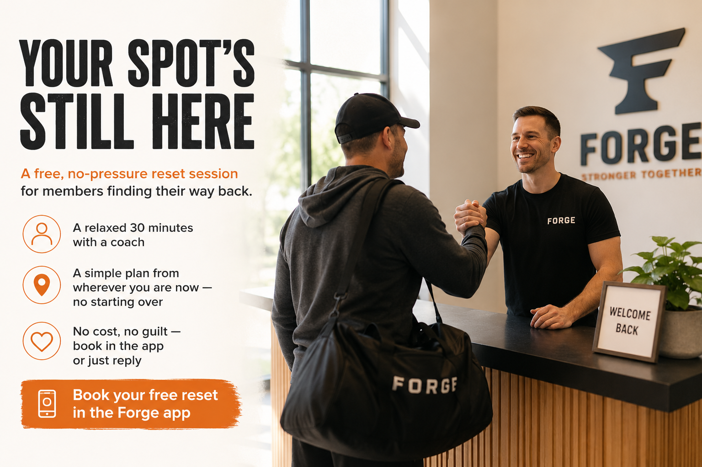

# Example 3 — "Welcome Back" win-back

**Persona:** Lapsed Member · **Goal:** re-activate dormant members · **Deliverable:** email + 2 social + flyer

This one deliberately requests a *partial* kit, to show the system flexes to the brief.

---

## INPUT — the brief

```text
CAMPAIGN BRIEF
- Campaign name: Welcome Back
- Goal: re-activate 40 members who haven't visited in 60+ days
- Target persona: Lapsed Member
- The one action we want them to take: come in for one no-pressure "reset" session
- Offer or hook: a free 30-min reset with a coach to rebuild a simple plan
- Key dates: ongoing through the month
- Must-include details: no cost, no guilt, book by reply or in the app
- Deliverables: 1 email + 2 social posts + 1 flyer concept
- Anything to avoid this time: absolutely no guilt or "we've missed your money" energy
```

---

## OUTPUT — the plan

- **Goal:** bring 40 dormant members back for one low-stakes "reset" session.
- **Persona & action:** Lapsed Member → book a free 30-minute reset with a coach.
- **Angle:** "You haven't lost your progress — and you definitely haven't lost your
  spot here. Come back for one easy session." Warmth and zero guilt.
- **Deliverables:** 1 email, 2 social posts, 1 flyer concept.

## OUTPUT — email

**Subject:** Your spot at Forge is still here
**Preview:** No guilt, no catch — just an easy way back in.

> Hi again,
>
> It's been a little while, and that's completely okay. Life gets busy, momentum
> slips, and the longer it's been the harder walking back in can feel. We get it.
>
> So here's an easy first step: a free 30-minute reset with one of our coaches. No
> hard session, no lecture — just a friendly catch-up and a simple plan to get you
> moving again from wherever you are now. You haven't lost your progress, and you
> certainly haven't lost your place here.
>
> Reply to this email or book in the app, and we'll sort a time that suits you.
>
> Good to have you back.
>
> — Sam, Head Coach at Forge Fitness

## OUTPUT — social posts

**Post 1**
> Been a while since your last session? No guilt here. 🙌
> If you've drifted off, we'd love to see you back — starting with a free 30-minute
> reset with a coach. Easy pace, simple plan, zero pressure. Your spot's still here.
> Book in the app or drop us a message.
> #RiversideGym #WelcomeBack

**Post 2**
> You don't start from scratch. You start from experience.
> Coming back after a break isn't square one — you already know this place and these
> people. Book a free reset session and we'll pick things up from where you are now.
> #RiversideGym #WelcomeBack

## OUTPUT — flyer concept

- **Headline:** Your Spot's Still Here
- **Subhead:** A free, no-pressure reset session for members finding their way back.
- **Bullets:**
  - A relaxed 30 minutes with a coach
  - A simple plan from wherever you are now — no starting over
  - No cost, no guilt — book in the app or just reply
- **Call-to-action:** Book your free reset in the Forge app
- **Image direction:** A returning member being greeted warmly at the front desk —
  smiles, a bit of relief, natural light. Reunion, not a workout shot.




[Forge_Welcome_back.png](https://github.com/carleclan/campaign-in-a-box/blob/main/examples/Forge_Welcome_back.png)

*Voice check: passed.*
